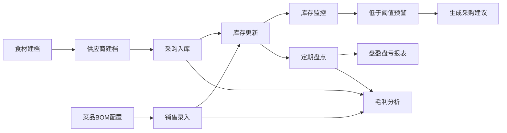

# 餐饮食材库存与成本管控系统 - 产品需求文档

## 1. 产品概述

面向小型餐饮门店（火锅店/烧烤店）的食材库存与成本管控工具，帮助门店实现食材全生命周期管理，从采购入库、库存监控到销售扣减和成本分析，有效降低食材损耗，提升毛利水平。

- **目标用户**：火锅店、烧烤店等小型餐饮门店的店长、后厨主管、采购人员
- **核心价值**：精细化库存管理、成本可控、数据驱动决策

## 2. 核心功能

### 2.1 用户角色

| 角色 | 注册方式 | 核心权限 |
|------|---------|---------|
| 门店管理员 | 系统初始化 | 全部功能权限，包括数据管理、报表查看、系统设置 |
| 后厨操作员 | 管理员创建 | 食材管理、盘点操作、库存查看 |
| 采购人员 | 管理员创建 | 供应商管理、采购入库、采购建议查看 |

### 2.2 功能模块

1. **仪表盘首页**：库存概览、预警提醒、关键指标、快捷操作
2. **食材管理**：食材信息录入、分类管理、库存查询、预警阈值设置
3. **供应商管理**：供应商档案、联系方式、供应品类维护
4. **采购管理**：采购入库、采购历史查询、采购详情
5. **菜品BOM管理**：菜品配方维护、食材用量配置
6. **销售管理**：销售录入、自动扣减库存、销售记录查询
7. **库存盘点**：盘点单创建、实盘录入、盘盈盘亏报表
8. **报表分析**：毛利分析、成本偏差、库存预警报表、采购建议

### 2.3 页面详情

| 页面名称 | 模块名称 | 功能描述 |
|---------|---------|----------|
| 仪表盘 | 数据概览 | 展示库存总金额、预警食材数、今日采购/销售、毛利趋势 |
| 仪表盘 | 预警提醒 | 低于安全库存的食材列表，一键生成采购建议 |
| 仪表盘 | 快捷入口 | 常用功能快速跳转按钮 |
| 食材管理 | 食材列表 | 食材信息展示、搜索筛选、分页 |
| 食材管理 | 新增/编辑食材 | 品名、规格、单位、当前库存、预警阈值、分类 |
| 供应商管理 | 供应商列表 | 供应商信息展示、搜索 |
| 供应商管理 | 新增/编辑供应商 | 名称、联系人、电话、地址、供应品类 |
| 采购管理 | 采购入库 | 选择供应商、添加食材明细、录入数量单价 |
| 采购管理 | 采购历史 | 采购单列表、详情查看、按时间筛选 |
| 菜品管理 | 菜品列表 | 菜品展示、分类筛选 |
| 菜品管理 | BOM配置 | 为菜品配置所需食材及用量 |
| 销售管理 | 销售录入 | 选择菜品、录入销售数量、自动扣减库存 |
| 销售管理 | 销售记录 | 销售历史查询、明细查看 |
| 库存盘点 | 盘点单列表 | 历史盘点记录、状态管理 |
| 库存盘点 | 创建盘点单 | 选择食材、录入实盘数量、自动计算盈亏 |
| 库存盘点 | 盘盈盘亏报表 | 盘点差异明细、盈亏金额统计 |
| 报表中心 | 毛利分析 | 按日/周/月统计实际成本、理论成本、偏差率 |
| 报表中心 | 采购建议 | 根据库存预警自动生成建议采购清单 |
| 报表中心 | 库存预警 | 低于安全库存食材详细列表 |

## 3. 核心流程

### 3.1 采购入库流程
门店采购人员选择供应商，添加采购食材明细，录入采购数量和单价，系统自动更新对应食材的库存数量，并计算加权平均成本价，同时记录采购历史。

### 3.2 销售扣减流程
每日营业结束后，录入菜品实际销售数量，系统根据菜品BOM自动计算所需食材总量并扣减库存，同时累加实际食材成本。

### 3.3 盘点流程
创建盘点单，选择需要盘点的食材，录入实际盘点数量，系统自动计算盈亏数量和金额，生成盘盈盘亏报表。

### 3.4 成本分析流程
系统按日/周/月维度，统计理论食材成本（按BOM计算）与实际食材成本（采购+盘点盈亏），计算偏差率供门店分析损耗。

## 4. 用户界面设计

### 4.1 设计风格
- **主色调**：深青色（#0F766E）传达专业、可靠的餐饮管理感
- **辅助色**：暖橙色（#F97316）用于预警和重要操作提示
- **成功色**：翠绿色（#10B981）表示正常、入库
- **警告色**：橙红色（#EF4444）表示预警、出库
- **中性色**：以灰白为主，确保数据清晰可读
- **整体风格**：简洁专业的后台管理风格，卡片式布局，数据可视化友好
- **按钮风格**：圆角矩形按钮，悬停有微交互效果
- **图标风格**：线性图标，简洁现代

### 4.2 页面设计概述

| 页面名称 | 模块名称 | UI元素 |
|---------|---------|--------|
| 仪表盘 | 数据概览 | 统计卡片、趋势图表、预警列表 |
| 食材管理 | 食材列表 | 表格布局、搜索栏、筛选标签、操作按钮 |
| 采购管理 | 采购入库 | 分步表单、食材明细表格、自动计算 |
| 报表中心 | 毛利分析 | 柱状图+折线图组合、时间切换、数据表格 |
| 库存盘点 | 盘点操作 | 实盘录入表格、差异高亮、汇总统计 |

### 4.3 响应式
- 桌面端优先设计，适配1366px及以上屏幕
- 侧边导航栏 + 主内容区的经典后台布局
- 表格支持横向滚动以适配小屏幕

### 4.4 动效设计
- 页面切换：淡入过渡效果
- 数据加载：骨架屏占位
- 按钮交互：hover时轻微上浮，点击有按压效果
- 预警提醒：脉冲动画吸引注意
- 数字变化：滚动动画增强数据感

## 5. 数据指标

### 5.1 核心指标
- 库存总金额
- 预警食材数量
- 期间采购总金额
- 期间销售总金额
- 食材毛利额及毛利率
- 成本偏差率

### 5.2 计算公式
- **加权平均成本** = (原有库存金额 + 新采购金额) / (原有库存数量 + 新采购数量)
- **理论食材成本** = Σ(菜品销售数量 × 菜品BOM食材用量 × 食材成本价)
- **实际食材成本** = 期初库存金额 + 本期采购金额 - 期末库存金额 + 盘亏金额 - 盘盈金额
- **成本偏差率** = (实际成本 - 理论成本) / 理论成本 × 100%
- **毛利率** = (营业收入 - 食材成本) / 营业收入 × 100%
