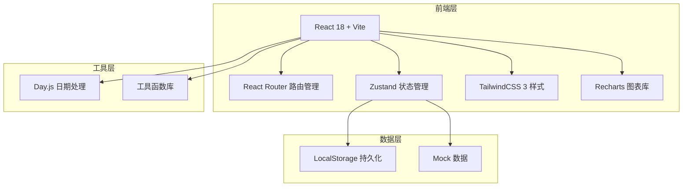
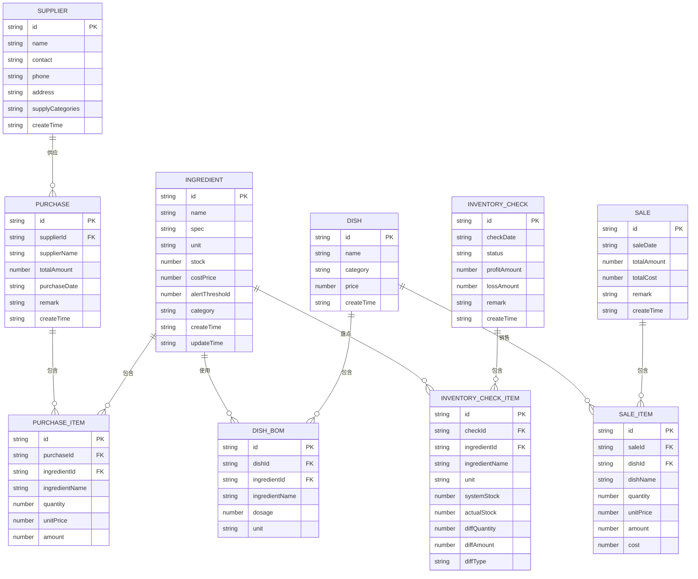

# 餐饮食材库存与成本管控系统 - 技术架构文档

## 1. 架构设计



## 2. 技术描述

- **前端框架**：React 18 + TypeScript
- **构建工具**：Vite 5
- **状态管理**：Zustand（轻量级，适合中小型应用）
- **样式方案**：TailwindCSS 3
- **路由管理**：React Router v6
- **图表库**：Recharts
- **日期处理**：Day.js
- **图标库**：Lucide React
- **数据持久化**：LocalStorage（前端模拟后端存储）
- **后端服务**：无（纯前端应用，使用 Mock 数据 + LocalStorage）

## 3. 目录结构

```
src/
├── assets/              # 静态资源
├── components/          # 通用组件
│   ├── Layout/         # 布局组件
│   ├── Table/          # 表格组件
│   ├── Modal/          # 弹窗组件
│   ├── Chart/          # 图表组件
│   └── common/         # 基础组件
├── pages/               # 页面组件
│   ├── Dashboard/      # 仪表盘
│   ├── Ingredients/    # 食材管理
│   ├── Suppliers/      # 供应商管理
│   ├── Purchases/      # 采购管理
│   ├── Dishes/         # 菜品管理
│   ├── Sales/          # 销售管理
│   ├── Inventory/      # 库存盘点
│   └── Reports/        # 报表中心
├── store/               # 状态管理
│   ├── useIngredientStore.ts
│   ├── useSupplierStore.ts
│   ├── usePurchaseStore.ts
│   ├── useDishStore.ts
│   ├── useSaleStore.ts
│   └── useInventoryStore.ts
├── types/               # TypeScript 类型定义
│   └── index.ts
├── utils/               # 工具函数
│   ├── storage.ts       # LocalStorage 封装
│   ├── date.ts          # 日期工具
│   ├── calc.ts          # 计算工具
│   └── mock.ts          # Mock 数据
├── hooks/               # 自定义 Hooks
├── App.tsx
├── main.tsx
└── index.css
```

## 4. 路由定义

| 路由路径 | 页面名称 | 说明 |
|---------|---------|------|
| / | 仪表盘 | 首页，数据概览和快捷入口 |
| /ingredients | 食材管理 | 食材列表、新增/编辑 |
| /suppliers | 供应商管理 | 供应商列表、新增/编辑 |
| /purchases | 采购管理 | 采购入库、采购历史 |
| /purchases/new | 采购入库 | 新建采购单 |
| /dishes | 菜品管理 | 菜品列表、BOM配置 |
| /sales | 销售管理 | 销售录入、销售记录 |
| /inventory | 库存盘点 | 盘点单列表、新建盘点 |
| /inventory/new | 创建盘点单 | 新建盘点单 |
| /reports/gross-profit | 毛利分析 | 毛利分析报表 |
| /reports/purchase-suggestion | 采购建议 | 采购建议清单 |
| /reports/stock-alert | 库存预警 | 库存预警报表 |

## 5. 数据模型

### 5.1 ER 图



### 5.2 类型定义

```typescript
// 食材
interface Ingredient {
  id: string;
  name: string;
  spec: string;
  unit: string;
  stock: number;
  costPrice: number;
  alertThreshold: number;
  category: string;
  createTime: string;
  updateTime: string;
}

// 供应商
interface Supplier {
  id: string;
  name: string;
  contact: string;
  phone: string;
  address: string;
  supplyCategories: string;
  createTime: string;
}

// 采购单
interface Purchase {
  id: string;
  supplierId: string;
  supplierName: string;
  items: PurchaseItem[];
  totalAmount: number;
  purchaseDate: string;
  remark: string;
  createTime: string;
}

interface PurchaseItem {
  id: string;
  ingredientId: string;
  ingredientName: string;
  quantity: number;
  unitPrice: number;
  amount: number;
}

// 菜品
interface Dish {
  id: string;
  name: string;
  category: string;
  price: number;
  bomItems: DishBomItem[];
  createTime: string;
}

interface DishBomItem {
  id: string;
  ingredientId: string;
  ingredientName: string;
  dosage: number;
  unit: string;
}

// 销售
interface Sale {
  id: string;
  saleDate: string;
  items: SaleItem[];
  totalAmount: number;
  totalCost: number;
  remark: string;
  createTime: string;
}

interface SaleItem {
  id: string;
  dishId: string;
  dishName: string;
  quantity: number;
  unitPrice: number;
  amount: number;
  cost: number;
}

// 盘点单
interface InventoryCheck {
  id: string;
  checkDate: string;
  items: InventoryCheckItem[];
  status: 'draft' | 'completed';
  profitAmount: number;
  lossAmount: number;
  remark: string;
  createTime: string;
}

interface InventoryCheckItem {
  id: string;
  ingredientId: string;
  ingredientName: string;
  unit: string;
  systemStock: number;
  actualStock: number;
  diffQuantity: number;
  diffAmount: number;
  diffType: 'profit' | 'loss' | 'equal';
}

// 毛利分析
interface GrossProfitReport {
  date: string;
  revenue: number;
  theoreticalCost: number;
  actualCost: number;
  grossProfit: number;
  grossProfitRate: number;
  deviationRate: number;
}
```

## 6. 状态管理设计

使用 Zustand 进行状态管理，按业务模块划分 store：

- **useIngredientStore**：食材数据管理（增删改查、库存更新）
- **useSupplierStore**：供应商数据管理
- **usePurchaseStore**：采购单管理（创建采购单、入库处理）
- **useDishStore**：菜品及BOM管理
- **useSaleStore**：销售管理（录入销售、扣减库存）
- **useInventoryStore**：盘点管理（创建盘点、计算盈亏）

每个 store 都包含：
- 数据列表 state
- 数据操作方法（增删改查）
- 持久化到 LocalStorage 的逻辑

## 7. 核心算法

### 7.1 加权平均成本计算

```
newCostPrice = (oldStock * oldCostPrice + purchaseQty * purchasePrice) / (oldStock + purchaseQty)
```

### 7.2 销售扣减库存

根据菜品BOM展开，计算每种食材的用量：
```
ingredientUsage = Σ(dishSaleQuantity * bomDosage)
```

### 7.3 理论成本计算

```
theoreticalCost = Σ(dishSaleQuantity * Σ(bomDosage * ingredientCostPrice))
```

### 7.4 成本偏差率

```
deviationRate = (actualCost - theoreticalCost) / theoreticalCost * 100%
```

### 7.5 采购建议算法

当库存低于预警阈值时，建议采购量 = 预警阈值 × 2 - 当前库存（可配置倍数）

## 8. 性能与优化

- 使用 Zustand 的选择性订阅减少重渲染
- 表格数据使用虚拟滚动（如数据量大时）
- LocalStorage 数据按需读取，避免频繁读写
- 使用 React.memo 优化通用组件性能
- 图表数据按需计算，避免重复计算

## 9. 数据持久化策略

- 所有业务数据存储在 LocalStorage 中
- 每个模块的数据单独存储（如 `ingredients`、`suppliers`）
- 应用启动时从 LocalStorage 加载数据
- 数据变更时自动同步到 LocalStorage
- 提供数据导入导出功能（可选扩展）
